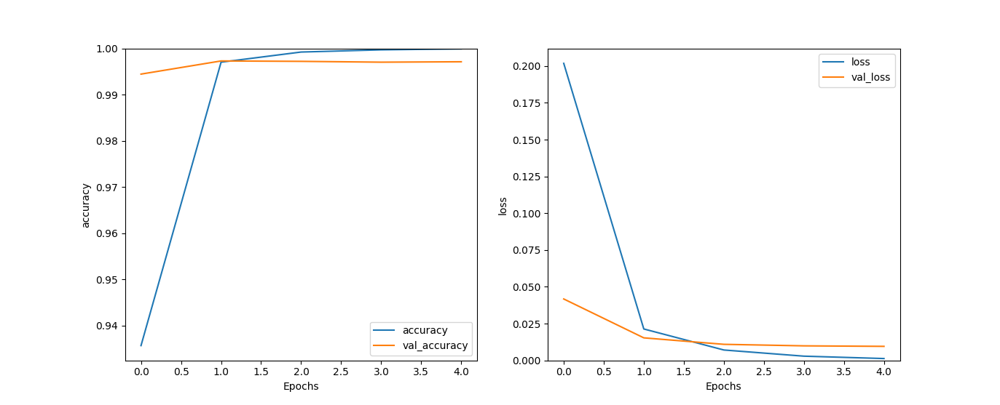

# Распознавание реальных и выдуманных новостей

В этом проекте мною построена модель рекуррентной нейронной сети, распознающая реальная или выдуманная новость

Данные получены из открытого набора с Kaggle - https://www.kaggle.com/datasets/clmentbisaillon/fake-and-real-news-dataset

## Архитектура модели

Данная модель представляет собой рекуррентную нейронную сеть, состоящую из 4 слоёв:

- Слой предварительной обработки, который векторизирует текстовые объекты. Данный слой был отдельно обучен на всём объёме данных

- Слой, превращающий положительные целочисленные векторы в полносвязные векторы фиксированного размера.

- Слой, представляющий двунаправленный рекуррентный блок данной нейронной сети

- Выходной слой состоит из 2 нейронов с функциями активации Softmax, количество нейронов соответствует размерности выходного массива, каждый элемент выходного массива предствляет вероятность того, что полученное на вход изображение соответсует классу, представленному элементом выходного массива

## Результаты

После 5 эпох обучения модель показала высокую точность 0.9999 на тренировочном и 0.9971 на тестовом наборе, потери 0.0013 сотавили на тренировочном и 0.0096 на тестовом наборе.

Построен график из которого исследуем модель на наличие переобучения, исходя из графика переобучения не произошло

